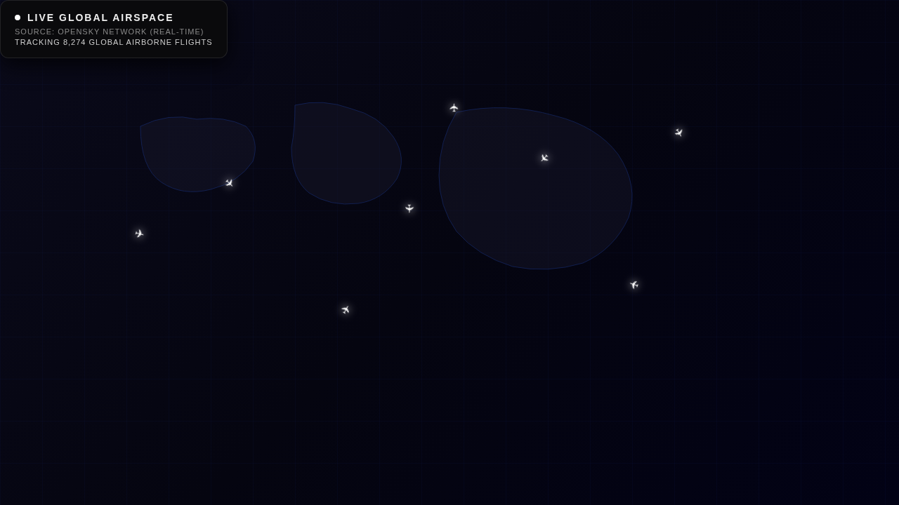
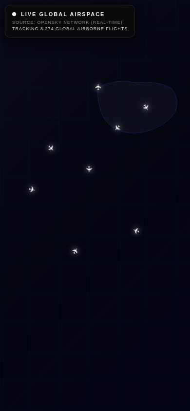

# Live Flight Radar ✈️🌍

### 🔴 [**View Live Site → anacondy.github.io/CARTO-flight-Gemini**](https://anacondy.github.io/CARTO-flight-Gemini)

A sleek, high-performance, real-time global flight tracker built with **Vanilla JavaScript**, **Leaflet.js**, and **two independent live ADS-B data sources** (the [OpenSky Network](https://opensky-network.org/) and [adsb.lol](https://adsb.lol)).

Inspired by high-contrast, dark-mode data visualizations, this radar features a beautiful "Dark Matter" aesthetic with glowing aircraft markers, smooth animations, and viewport-scoped data fetching for optimal performance and readability at any zoom level.

> 📋 **See [REPORT.md](REPORT.md) for the full project audit (2026-08-30)** — live source verification, every bug found & fixed, and the data methodology.

---

## 📸 Screenshots

### Desktop View


### Mobile View


> **Note:** Screenshots above show the UI shell. On the live site, the CARTO Dark Matter basemap and real aircraft populate the map in real time.

---

## ✨ Features

- **Real-Time Triple-Source Tracking:** Live state vectors from three independent community ADS-B networks, tried in fan-out order (adsb.fi → adsb.lol → OpenSky). Zoomed-in views refresh every **12 seconds**; wider views use OpenSky with credit-budgeted viewport queries. If your network blocks one source, the next one serves you automatically.
- **Automatic Failover + CORS-Relay Tier:** Per-route health tracking with automatic benching. If the flight APIs are reachable but CORS-blocked (common — they send no CORS headers), the same data is automatically retried through read-only CORS relays, and the winning route is remembered.
- **Dead-Reckoning Interpolation:** Between API fixes, every aircraft is advanced along its true track at its reported ground speed — planes **glide continuously** instead of teleporting on every poll.
- **Dark, Watermark-Free Aesthetic:** Default basemap is Esri's key-free **World Dark Gray** canvas. (CARTO raster tiles now carry an *"API key required"* watermark for keyless use — set the free `CONFIG.CARTO_KEY` in `index.html` to restore the original Dark Matter look.)
- **Smart Viewport Rendering:** Data is fetched **for the area you're looking at**, and HTML markers are only created for aircraft currently visible within your screen bounds (viewport culling), with a marker cap at world zoom to keep things smooth on phones.
- **Interactive Tooltips & Popups:**
  - Zoom in (level 7+) to reveal permanent text callsigns floating above the aircraft.
  - Click any aircraft for live telemetry: origin country *or* registration & aircraft type, altitude, speed (km/h), and heading — refreshed on every data fix.
- **Rate-Limit Handling:** Credit-aware polling intervals, exponential back-off, no overlapping requests, and polling paused in background tabs. A "Holding Pattern" state appears if OpenSky's anonymous quota is temporarily exhausted.
- **Fully Responsive:** Works seamlessly on all screen sizes — desktop, tablet, and mobile — with safe-area insets for notched devices.
- **CDN-Outage Proof:** Leaflet is self-hosted (no unpkg/jsdelivr dependency) and the basemap automatically falls back to a dark-tinted OpenStreetMap layer if CARTO tiles are unreachable. If anything is still blocked on your network, [`diag.html`](diag.html) pinpoints it in seconds.
- **Security Hardened:** Content Security Policy, Subresource Integrity (SRI) on all vendored assets, and HTML escaping of **all** API data.
- **Zero Build Tools:** One HTML file. Open it and it works.

---

## 🚀 Tech Stack

This project is incredibly lightweight and requires **zero build tools**.

| Layer | Technology |
|---|---|
| Frontend | HTML5, CSS3, Vanilla JavaScript (ES6+) |
| Mapping Engine | [Leaflet.js](https://leafletjs.com/) v1.9.4 — **self-hosted** under `vendor/leaflet/` (no CDN) |
| Basemap | [Esri World Dark Gray](https://server.arcgisonline.com/) (key-free) · [CARTO Dark Matter](https://carto.com/basemaps/) opt-in via free key · dark-tinted [OpenStreetMap](https://www.openstreetmap.org) auto-fallback |
| Live Data | [adsb.fi](https://github.com/adsbfi/opendata) + [adsb.lol](https://api.adsb.lol/docs) + [OpenSky Network](https://opensky-network.org/apidoc/) — automatic fan-out |
| Tests | Node.js (`node test/app.test.mjs` — no dependencies) |
| Hosting | GitHub Pages (auto-deployed via GitHub Actions) |

---

## 🛠️ How to Run Locally

Because this project uses entirely client-side, vanilla web technologies without any build steps (like Webpack or Vite), running it is as simple as opening a file.

**1. Clone the repository:**

```bash
git clone https://github.com/anacondy/CARTO-flight-Gemini.git
cd CARTO-flight-Gemini
```

**2. Open the file:**

Simply double-click `index.html` to open it in your default web browser.

*(Alternatively, use an extension like [VSCode Live Server](https://marketplace.visualstudio.com/items?itemName=ritwickdey.LiveServer) for hot-reloading.)*

**3. (Optional) Run the test suite:**

```bash
node test/app.test.mjs   # 79 assertions: dead-reckoning maths, source normalisation,
                         # credit budgeting, vendored-asset integrity, wiring & security
```

> 🩺 **Map or data not appearing?** Open [`diag.html`](diag.html) — it checks every dependency
> the radar needs (map engine, both basemap hosts, both live data APIs) from your own browser
> and shows exactly which one is blocked on your network.

---

## 📡 API & Data Usage

This project is powered by two free, community-run ADS-B aggregators providing open access to real flight tracking data.

### OpenSky Network ([/api/states/all](https://opensky-network.org/apidoc/))

> ⚠️ **2026 status:** basic authentication was removed in March 2026 (OAuth2 client credentials
> replace it). **Anonymous** access still works but is limited to **400 credits/day** per user,
> where a `/states/all` request costs **1–4 credits depending on bounding-box area**
> (≤25 sq° = 1 … global = 4).

The app is engineered around that budget:

- Requests are **scoped to your viewport** (a city-scale box costs 1 credit, not 4).
- Poll intervals adapt to the cost (90 s for regional boxes, 150 s for world views).
- HTTP 429 triggers exponential back-off (×2 up to ×8), and polling pauses in hidden tabs.
- With dead reckoning filling the gaps, the radar still animates smoothly between fixes.

### adsb.fi ([opendata.adsb.fi/api/v3](https://github.com/adsbfi/opendata)) & adsb.lol ([/v2](https://api.adsb.lol/docs))

- No key, no credits, ~1 req/s etiquette — the app polls every 12 s.
- Tried **in fan-out order** whenever the view radius is ≤ 250 nm (i.e. whenever you're actually looking at a region), and as fallbacks when zoomed out.
- Adds airframe details (registration, aircraft type/description) to the popup.

### CORS reality & the relay tier

None of the three flight APIs send `Access-Control-Allow-Origin`, so browsers cannot read them
directly from a webpage (they work fine server-side). The engine handles this automatically:

1. Try each API **directly** (works when a network/extension path allows it).
2. Retry the same query through read-only **CORS relays** (corsproxy.io → allorigins → codetabs)
   — only small payloads, health-tracked, with the winning route remembered.
3. For a **production** deployment, deploy your own relay in 2 minutes with
   [`extras/cloudflare-worker.js`](extras/cloudflare-worker.js) (free tier, allow-listed to the
   three APIs) and set `CONFIG.PROXY_BASE` in `index.html`.

### Data characteristics

- **What you see:** every aircraft broadcasting ADS-B with a position — passenger airliners,
  cargo, business jets, general aviation, helicopters, some military. Grounded aircraft are
  filtered out.
- **Latency:** typically **< 15 s** behind reality when zoomed in (12 s polling + per-second
  dead-reckoning interpolation); up to ~2.5 min on zoomed-out OpenSky views (credit budget).
- **Coverage & reliability:** three independent community networks; coverage follows volunteer
  receivers — dense over Europe, North America and India, sparser over oceans and remote regions.
  No SLA — community infrastructure, used with automatic failover.

---

## ⚙️ How It Works

```
┌─────────────────────────────────────────────────────────────────┐
│                         Browser (Client)                        │
│                                                                 │
│  planQuery(): pick source from current view radius              │
│   ├─ ≤ 250 nm ──► adsb.lol point query        (12 s refresh)    │
│  └─ wider ──────► OpenSky viewport bbox query (90–150 s,        │
│                   1–4 credits by area)          credit-budgeted)│
│         │            (either falls back to the other on failure)│
│         ▼                                                       │
│  normalize → unified aircraft model {lat, lon, track, vel, alt} │
│         ▼                                                       │
│  Dead reckoning (1 s tick): advance each aircraft along its     │
│  track at its ground speed → CSS-transition glide, no teleports │
│         ▼                                                       │
│  Viewport culling → only markers in view bounds are rendered    │
│  Popups & labels refreshed on every fix                         │
│         │                                                       │
│         ▼                                                       │
│  ┌──────────────────────┐    ┌───────────────────────────────┐ │
│  │  Leaflet.js Map      │    │  CARTO Dark Matter Tiles      │ │
│  │  (DivIcon markers)   │    │  basemaps.cartocdn.com        │ │
│  └──────────────────────┘    └───────────────────────────────┘ │
└─────────────────────────────────────────────────────────────────┘
```

1. **On page load**, `refresh()` runs immediately, then **self-schedules** the next poll based on which source served the view (no `setInterval`, so requests can never overlap).
2. Each source's payload is normalized into one internal aircraft model (position, true track, ground speed, altitude, callsign, fix age).
3. Flights without a valid lat/lon or on the ground are filtered out.
4. `syncMarkers()` **creates, updates, or removes** Leaflet `DivIcon` markers for the current viewport only.
5. A 1-second `tick()` **dead-reckons** every rendered aircraft from its last fix to *now*; a matching CSS `transform` transition makes the movement continuous. Extrapolation is capped (2–5 min) so silent aircraft freeze rather than drift forever.
6. All popup/tooltip content from the APIs is **HTML-escaped** before rendering to prevent XSS.

---

## 🔒 Security

| Measure | Details |
|---|---|
| **No third-party code** | Leaflet is self-hosted under `vendor/leaflet/` — nothing loads from a code CDN; SRI hashes (verified by the test suite) protect the vendored files |
| **Content Security Policy** | `<meta>` CSP restricts all resource origins to only what's needed (self + the two data APIs + the two tile hosts) |
| **HTML Escaping** | All API data (callsign, country, registration, type) is escaped before rendering into popups and labels |
| **Referrer Policy** | `strict-origin-when-cross-origin` (valid via meta) |
| **No eval / no frames / no forms** | `default-src 'none'`; logic is plain inline JS |

> ℹ️ `X-Content-Type-Options` and `Permissions-Policy` are HTTP-response headers that browsers
> ignore when set via `<meta>`; they remain in the HTML as documentation of intent for a future
> host that can set real headers (GitHub Pages cannot).

---

## 🤝 Contributing

Contributions, issues, and feature requests are welcome!

Feel free to check the [issues page](https://github.com/anacondy/CARTO-flight-Gemini/issues).

---

## 📝 License

This project is open source and available under the [MIT License](LICENSE).

---

*Created with ❤️ by [Anacondy](https://github.com/anacondy) & Gemini*
